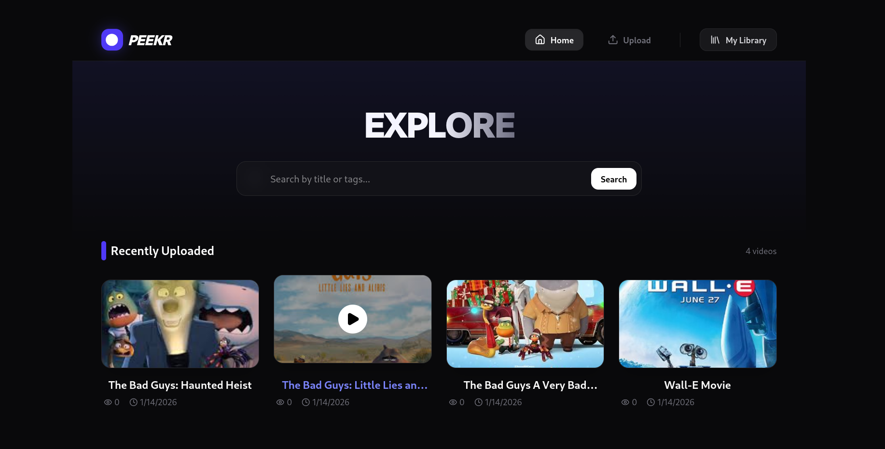
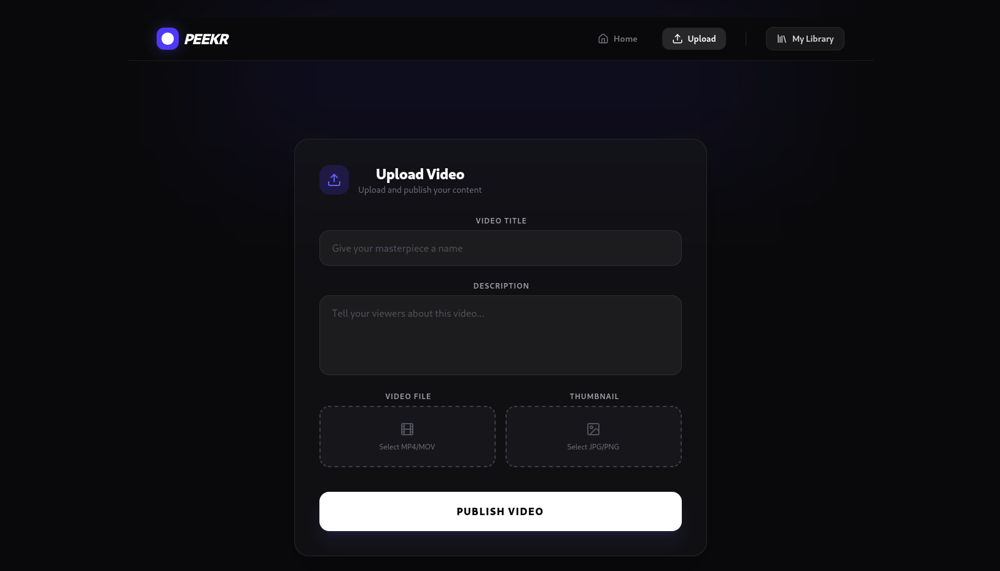
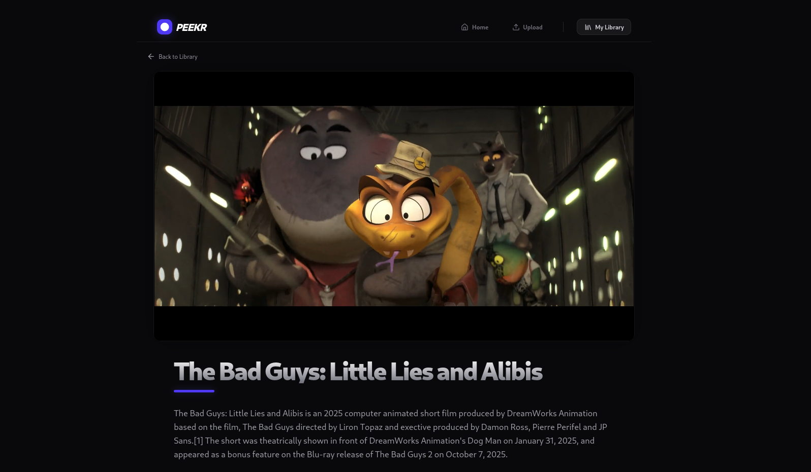
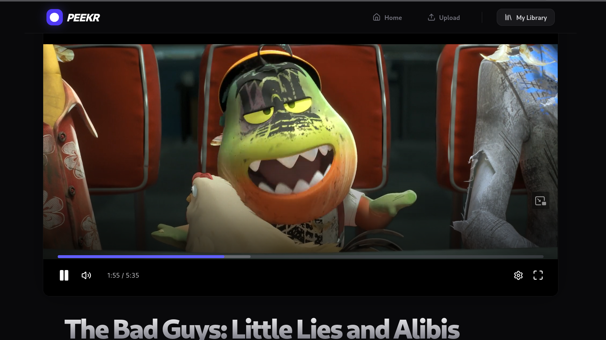

# 🎥 Peekr Video Streaming Platform

A self-hosted video streaming platform built for **performance, reliability, and developer control**, using **HLS video streaming**, **GPU-accelerated FFmpeg**, and a **Btrfs-based storage architecture**.

This project is designed to demonstrate how modern video platforms can be built **without relying on cloud object storage**, while still remaining scalable and fault-tolerant.

---

## 🌟 Key Highlights

* Self-hosted video streaming (no third-party storage dependency)
* HLS adaptive streaming using FFmpeg
* NVIDIA GPU-accelerated video encoding
* Btrfs filesystem with snapshots and RAID support
* React frontend with modern UI
* Express + MongoDB backend
* Designed for local hosting, VPS, or private infrastructure

---

## 🗄️ Storage Architecture (Btrfs First Design)

This project intentionally uses the **Btrfs filesystem** as the primary video storage layer.

### Why Btrfs?

* **Snapshots**
  Instant, space-efficient snapshots allow recovery from:

  * accidental deletions
  * failed uploads
  * corrupted transcodes

* **RAID support**
  Native Btrfs RAID enables:

  * disk redundancy
  * high availability
  * safer self-hosting

* **Copy-on-Write (CoW)**
  Prevents data corruption during video processing and file operations.

* **Filesystem-level integrity checks**
  Ensures long-term video data reliability.

Each uploaded video is stored in its own isolated directory, making backups and restores trivial.

---

## 🎞️ Video Streaming (HLS + FFmpeg)

Videos are converted into **HTTP Live Streaming (HLS)** format using **FFmpeg**.

### Conversion Process

1. Original video is uploaded
2. FFmpeg converts it into:

   * `.m3u8` playlist
   * `.ts` video segments
3. Original file is removed after successful conversion
4. HLS files are served directly to the client

### FFmpeg Features Used

* NVIDIA GPU acceleration (NVENC)
* AAC audio encoding
* HLS segmenting for adaptive streaming
* Browser-compatible video format

This approach ensures:

* Smooth playback
* Efficient bandwidth usage
* Wide device compatibility

---

## 🧠 Backend Overview (Node.js + Express)

The backend is responsible for:

* Handling video uploads
* Managing FFmpeg transcoding
* Storing metadata in MongoDB
* Serving HLS streams and thumbnails
* Providing REST APIs for frontend consumption

### Key Characteristics

* Clean REST API design
* GPU-accelerated video processing
* Local filesystem as source of truth
* MongoDB used only for metadata
* Designed for future migration to blob storage if needed

---

## 🎨 Frontend Overview (React)

The frontend is built using **React** and focuses on simplicity and usability.

### Features

* Video listing page
* Upload interface
* Thumbnail previews
* HLS video player integration
* Responsive layout

The frontend communicates with the backend via REST APIs and plays videos using standard HLS-compatible players.

---

## 🧪 Self-Hosting & Development Friendly

This project supports:

* Local development
* LAN access
* Remote testing using Cloudflare Tunnel
* VPS deployment without architectural changes

No vendor lock-in. Full control over data and infrastructure.

---
## 🖼️ Application Screenshots

### 🏠 Home Page

---

### ⬆️ Upload Page

---

### ▶️ Player Page

---

### 🎬 Video Playing

---

## 🚀 Future Improvements

* Adaptive bitrate (multi-resolution HLS)
* Background job queue for transcoding
* Authentication and access control
* CDN integration (optional)
* Blob storage backend support
* Dockerized deployment

---

## 📌 Conclusion

This project demonstrates that **high-quality video streaming platforms can be built and self-hosted** using open-source tools, modern web technologies, and advanced filesystems like **Btrfs**.

It is ideal for:

* learning purposes
* internal platforms
* private deployments
* proof-of-concept streaming services

---

**Built with control, performance, and transparency in mind.**
